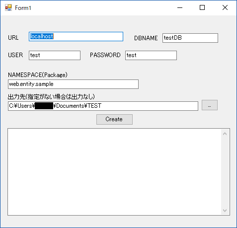

# PostgreSQL2POJO
PostgreSQLのテーブルからPOJOを作る

## ツールの使い方
  

1. 下記を入力します。
* URL  
  DBのアドレス。  
  初期値：localhost
* DBNAME  
  DBのスキーマ名  
  初期値：入力なし
* USER  
  DBのユーザー名  
  初期値：入力なし
* PASSWORD  
  DBのパスワード  
  初期値：入力なし
* NAMESPACE(Package)  
  ファイル出力時に設定するパッケージ名  
  初期値：入力なし
* 出力先  
  ファイルの出力先となるフォルダパス  
  初期値：入力なし
1. Createボタンをクリックします。
1. 出力先のフォルダにクラス単位でファイルが作成されます。

### 出力ファイル例
スネークケースからキャメルケースに変換します。
* テーブル名  
  M_USER → MUserEntity
* フィールド名  
  USER_NAME → userName
* セッターメソッド  
  USER_NAME → setUserName
* ゲッターメソッド  
  USER_NAME → getUserName

### DBデータ型とJavadデータ型の変換表
TODO 変換表を書く。
